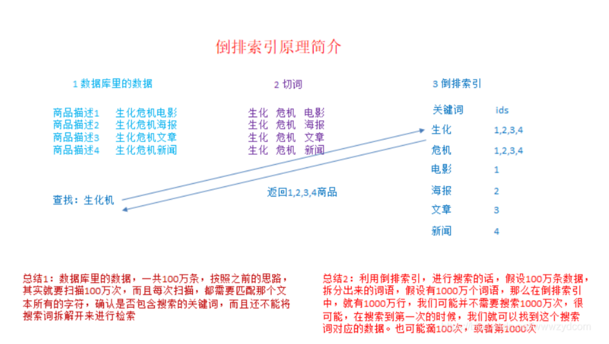
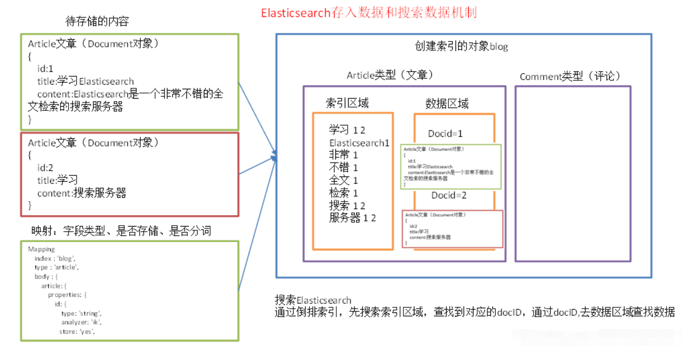
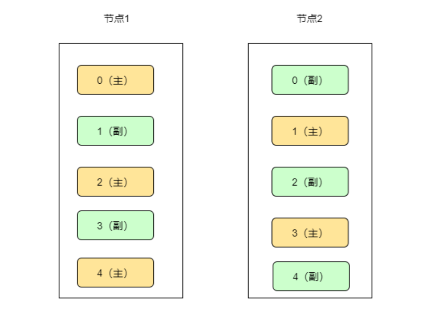
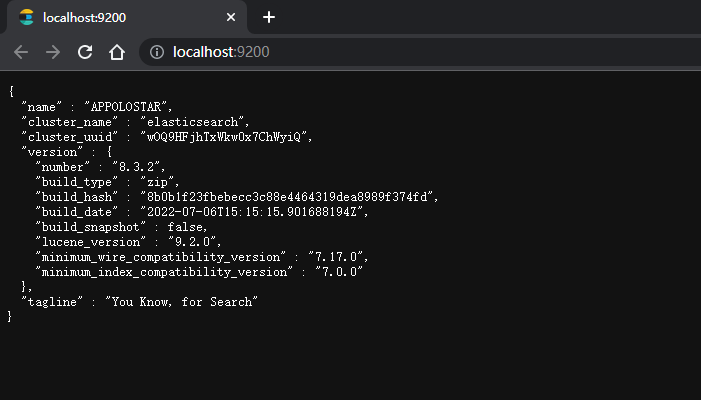
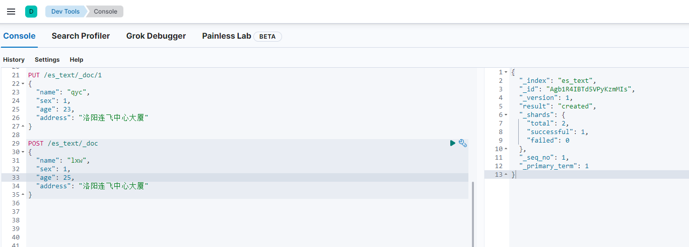
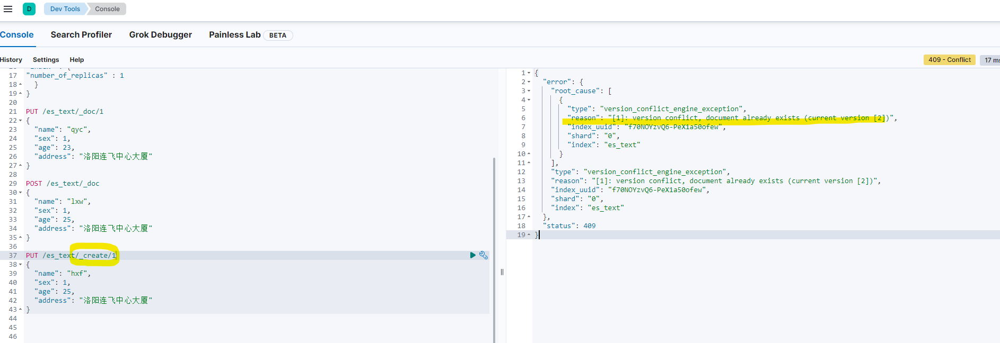
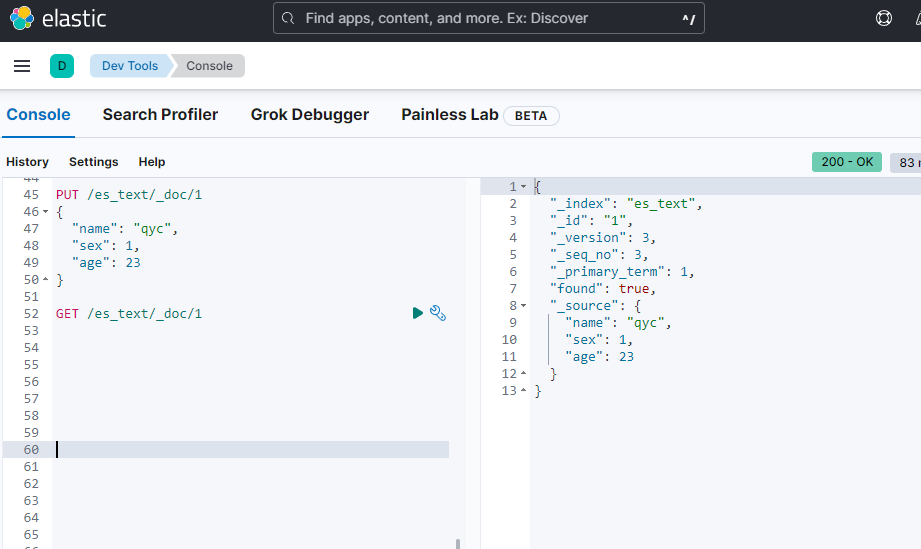
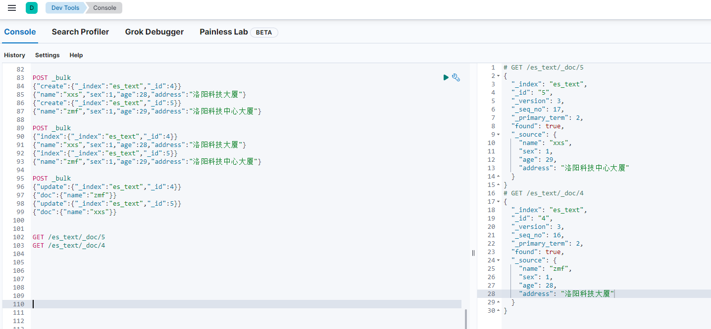
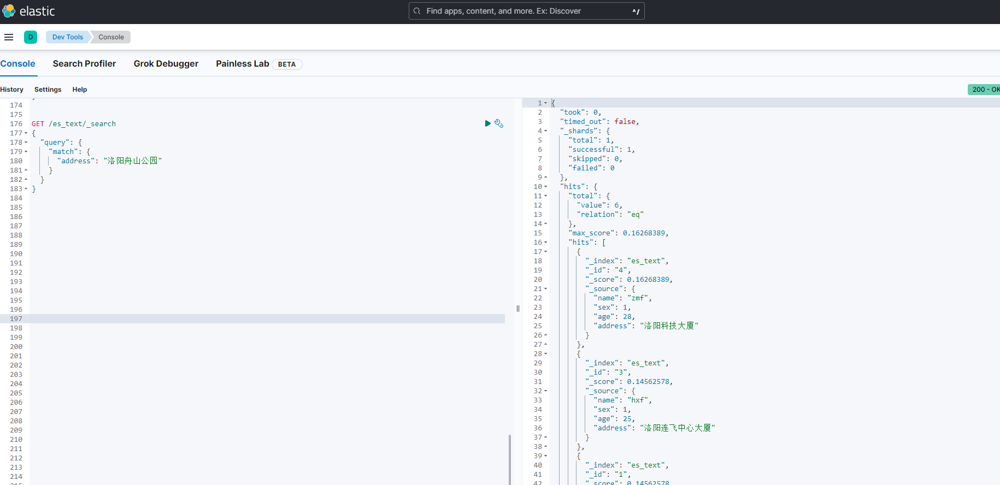

## ElasticSearch 开发手册

作者:[appolostar](https://github.com/appolostar)

**开源的高扩展的分布式全文搜索引擎**


### elasticsearch与数据库的类比

| 关系型数据库（比如Mysql） | 非关系型数据库（Elasticsearch） |
| ------------------------- | ------------------------------- |
| 数据库Database            | 索引Index                       |
| 表Table                   | 类型Type（7.0之后移除）         |
| 数据行Row                 | 文档Document                    |
| 数据列Column              | 字段Field                       |
| 约束 Schema               | 映射Mapping                     |

### **1、index、type的初衷**

之前es将index、type类比于[关系型数据库](https://so.csdn.net/so/search?q=关系型数据库&spm=1001.2101.3001.7020)（例如mysql）中database、table，这么考虑的目的是“方便管理数据之间的关系”。

【本来为了方便管理数据之间的关系，类比database-table 设计了index-type模型】

### **2、为什么现在要移除type？**

2.1 在关系型数据库中table是独立的（独立存储），但es中同一个index中不同type是存储在同一个索引中的（lucene的索引文件），因此不同type中相同名字的字段的定义（mapping）必须一致。



### ES存入数据和搜索数据机制



(1)索引对象(blog):存储数据的表结构,任何搜索数据,存放在索引对象上
(2)映射(mapping):数据如何存放在索引对象上,需要有一个映射配置,包括数据类型,是否存储,是否分词等
(3)文档(document):一条数据记录,存在索引对象上
(4)文档类型(type):一个索引对象,存放多种类型数据,数据用文档类型进行标识什么是分片


什么是分片

Elasticsearch集群允许系统存储的数据量超过单机容量，这是通过shard实现的。在一个索引index中，数据（document）被分片处理（sharding）到多个分片上。也就是说：每个分片都保存了全部数据中的一部分。

        一个分片是一个 Lucene 的实例，它本身就是一个完整的搜索引擎。文档被存储到分片内，但应用程序直接与索引而不是与分片进行交互。

什么是副本
说明

        为了解决访问压力过大时单机无法处理所有请求的问题，Elasticsearch集群引入了副本策略replica。副本策略对index中的每个分片创建冗余的副本。

副本的作用如下：

1. 提高系统容错性

        当分片所在的机器宕机时，Elasticsearch可以使用其副本进行恢复，从而避免数据丢失。

2. 提高ES查询效率

        处理查询时，ES会把副本分片和主分片公平对待，将查询请求负载均衡到副本分片和主分片。

副本分片是越多越好吗？

答案当然是 no ，原因有以下两点：

（1）多个 replica 可以提升搜索操作的吞吐量和性能，但是如果只是在相同节点数目的集群上增加更多的副本分片并不能提高性能，因为每个分片从节点上获得的资源会变少，这个时候你就需要增加更多的硬件资源来提升吞吐量。

（2）更多的副本分片数提高了数据冗余量，保证了数据的完整性，但是根据上边主副分片之间的交互原理可知，分片间的数据同步会占用一定的网络带宽，影响效率，所以索引的分片数和副本数也不是越多越好。


 一个节点就是集群中的一个服务器，也可以理解为，一个节点就是一个ES，作为集群的一部分，他储存数据，参与集群的索引和搜索功能，和集群类似，一个节点也是由一个名字来标识的，默认情况下，这个名字可以随意起，并且会在启动的时候赋予节点这个名字，
        
        一个节点可以通过配置集群名称的方式来加入一个指定的集群。默认情况下，每个节点都会被安排加入到一个叫 做 “elasticsearch” 的集群中，这意味着，如果你在你的网络中启动了 若干个节点 ，并假定它们 能够相互发现彼此 ， 它们将会 自动地形成并加入 到一个叫做 “elasticsearch” 的集群中。
 1.首先准备三台es服务器，我没有三台电脑，就一台电脑上启动三个es服务器，把我们原先的es文件夹复制三份，


2、 在yml文件中设置


这里我设置了三个节点组成的集群，如果想设置多个，就多创建几个服务器文件夹，然后修改里面的配置文件，并且每个node的端口号和名字都不能一样，设置各个node可以互相发现即可。

 cluster-2和cluster-3和cluster-1是一样的操作。

​    3.当我们修改好了配置文件和创建新的服务器后，每个文件夹下的data目录里面一定要是空的，不能带任何内容。

  4.我们把三个es服务器都启动

5.连接上es-header，grunt server，登陆head界面

​       输入我们服务器的端口号，这里我设置的是9201，9202，9203，结果都是一样的。

​       他们三个端口号的内容都是相同的，储存着一样的内容


一个节点在访问量和搜索量非常大的情况下，可能就会非常慢，或者某个节点中的分片负载太严重挂掉，而设置了集群，我们索引库的分片就会分散在各个分节点上，而且每个节点储存的分片是不相同的（相同的原分片和副本分片不会出现在同一个节点身上），这样就可以保证，我们大量用户搜索或者访问的时候，把我们的压力分散到每一个节点上
**示例1：启动2个ES节点。创建5个分片，1个副本**




 上图中，黄色的代表主分片，绿色的是副本。可以发现，分片与其副本不在同一个节点内。这是非常合理的，因为副本本来就是主分片的备胎，当主分片节点挂了，另外一个节点的副本将会充当主分片，如果它们在同一个节点内，副本将发挥不到作用。

7.分片

       一个索引可以存储超出单个结点硬件限制的大量数据。比如，一个具有10亿文档的索引占据1TB的磁盘空间，而任 一节点都没有这样大的磁盘空间，或者单个节点处理搜索请求，响应太慢。为了解决这个问题，Elasticsearch提供 了将索引划分成多份的能力，这些份就叫做分片。当你创建一个索引的时候，你可以指定你想要的分片的数量。每个分片本身也是一个功能完善并且独立的“索引”，这个“索引”可以被放置到集群中的任何节点上。分片很重要，主要有两方面的原因：1）允许你水平分割/扩展你的内容容量。 2）允许你在分片（潜在地，位于多个节点上）之上进行分布式的、并行的操作，进而提高性能/吞吐量。
    
        简单点来说就是，每个分片就包含了你索引库中的某一部分的内容，可以理解为一本书的目录（因为分片储存的就是索引），而分片是支持扩容的，当我们有大量的文档，由于内存不足，磁盘限制，速度极度下降，我们就需要扩容，这时一个节点就不够用了，所以我们需要把目录（分片）放到不同的空间中，也就是集群节点，这样当我们搜索某一个内容的时候，ES会把要查询的内容发给相关的分片，并将结果组合到一起。
### 安装

基于Java语言开发的搜索引擎库类

官网：[免费且开放的搜索：Elasticsearch、ELK 和 Kibana 的开发者 | Elastic](https://www.elastic.co/cn/)

下载：[Elasticsearch 8.3.2 | Elastic](https://www.elastic.co/cn/downloads/past-releases/elasticsearch-8-3-2)

解压：

配置环境：


由于es对java环境要求高，可以使用其内置的java环境，下面对其进行系统环境配置：

添加系统变量


将\elasticsearch-8.3.2\config下的主配置文件**elasticsearch.yml**进行修改：

修改：

```
xpack.security.enabled: false

ingest.geoip.downloader.enabled: false
```

config/**jvm.option**配置文件，调整jvm堆内存大小：

修改：

```
vim jvm.options
-Xms4g
-Xmx4g
```

建议不大于内存的一半

Xms和Xms设置成—样

直接运行**elasticsearch.bat**

运行http://localhost:9200/测试



如图效果正常

### 客户端Kibana安装

Kibana是一个开源分析和可视化平台，旨在与Elasticsearch协同工作。

下载：[Kibana 8.3.2 | Elastic](https://www.elastic.co/cn/downloads/past-releases/kibana-8-3-2)

解压：

启动\kibana-8.3.2\bin下的kibana

访问Kibana: http://localhost:5601/


出现该界面启动成功


### ElasticSearch基本概念

- 传统关系型数据库和Elasticsearch的区别

在Elasticsearch中，文档归属于一种 类型(type) ,而这些类型存在于 索引(index)中，类比传统关系型数据库：

| Relational DB | Databases | Tables | Rows      | Columns |
| ------------- | --------- | ------ | --------- | ------- |
| 关系型数据库  | 数据库    | 表     | 行        | 列      |
| Elasticsearch | Indices   | Types  | Documents | Fields  |
| Elasticsearch | 索引      | 类型   | 文档      | 域      |

在Elasticsearch中，所有的字段缺省都建了索引。 也就是说每一个字段都有一个倒排索引，用于快速查询。
es支持http协议（json格式）（9200端口）、thrift、servlet、memcached、zeroMQ等的传输协议（通过插件方式集成）。传统关系型数据库不支持。
es支持分片和复制，从而方便水平分割和扩展，复制保证了es的高可用与高吞吐。

- 索引（Index）

一个索引就是一个拥有几分相似特征的文档的集合。比如说，可以有一个客户数据的索引，另一个产品 目录的索引，还有一个订单数据的索引。 一个索引由一个名字来标识（必须全部是小写字母的），并且当我们要对对应于这个索引中的文档进行 索引、搜索、更新和删除的时候，都要使用到这个名字。

- 文档（Document）

 Elasticsearch是面向文档的，文档是所有可搜索数据的最小单位。

文档会被序列化成JSON格式，保存在Elasticsearch中

JSON对象由字段组成

每个字段都有对应的字段类型(字符串/数值/布尔/日期/二进制/范围类型) 

每个文档都有一个Unique ID

可以自己指定ID或者通过Elasticsearch自动生成

一篇文档包含了一系列字段，类似数据库表中的一条记录

JSON文档，格式灵活，不需要预先定义格式

字段的类型可以指定或者通过Elasticsearch自动推算 支持数组/支持嵌套


### ElasticSearch索引操作

**创建索引**

索引命名必须小写，不能以下划线开头 格式: PUT /索引名称

```
#创建索引
PUT /es_text
#创建索引时可以设置分片数和副本数
PUT /es_text
{
"settings" : {
"number_of_shards" : 3,
"number_of_replicas" : 2
}
}

#修改索引配置
PUT /es_text/_settings
{
"index" : {
"number_of_replicas" : 1
}
}
```

**查询索引**

```
#查询索引
GET /es_db
#es_text是否存在
HEAD /es_db
```

**删除索引**

```
DELETE /es_db
```

### ElasticSearch文档操作

**添加文档**

- 格式: [PUT | POST] /索引名称/[_doc | _create ]/id

```
# 创建文档,指定id
# 如果id不存在，创建新的文档，否则先删除现有文档，再创建新的文档，版本会增加
PUT /es_text/_doc/1
{
  "name": "qyc",
  "sex": 1,
  "age": 23,
  "address": "洛阳连飞中心大厦"
}

POST /es_text/_doc
{
  "name": "lxw",
  "sex": 1,
  "age": 25,
  "address": "洛阳连飞中心大厦"
}

PUT /es_text/_create/1
{
  "name": "hxf",
  "sex": 1,
  "age": 25,
  "address": "洛阳连飞中心大厦"
}

```




POST和PUT都能起到创建/更新的作用，PUT需要对一个具体的资源进行操作也就是要确定id才能 进行更新/创建，而POST是可以针对整个资源集合进行操作的，如果不写id就由ES生成一个唯一id进行 创建新文档，如果填了id那就针对这个id的文档进行创建/更新



Create -如果ID已经存在，会失败

**修改文档**

- 全量更新，整个json都会替换，格式: [PUT | POST] /索引名称/_doc/id

如果文档存在，现有文档会被删除，新的文档会被索引

```
# 全量更新，替换整个json
PUT /es_text/_doc/1
{
  "name": "qyc",
  "sex": 1,
  "age": 23,
}
#查询文档
GET /es_text/_doc/1

```



- 使用update部分更新，格式: POST /索引名称/update/id update

不会删除原来的文档，而是实现真正的数据更新

```
# 部分更新：在原有文档上更新
# Update -文档必须已经存在，更新只会对相应字段做增量修改
POST /es_text/_update/1
{
  "doc":{
    "age": 24
  }
}

GET /es_text/_doc/1
```


- 使用 _update_by_query 更新文档

  

```
POST /es_text/_update_by_query
{
  "query": {
    "match": {
      "_id": 1
    }
  },
  "script": {
  "source": "ctx._source.age = 22"
  }
}

GET /es_text/_doc/1
```


**查询文档**

根据id查询文档，格式: GET /索引名称/doc/id

```
GET /es_text/_doc/1
```

条件查询 search，格式： /索引名称/doc/_search

```
# 查询前10条文档（默认）
GET /es_text/_doc/_search
```

ES Search API提供了两种条件查询搜索方式： 

REST风格的请求URI，直接将参数带过去 （8.x之后不再提供）

封装到request body中，这种方式可以定义更加易读的JSON格式（后面写了）

**删除文档**

- 格式: DELETE /索引名称/_doc/id

```
DELETE /es_db/_doc/1
```

**ElasticSearch文档批量操作**

批量操作可以减少网络连接所产生的开销，提升性能 支持在一次API调用中，对不同的索引进行操作 可以再URI中指定Index，也可以在请求的Payload中进行 操作中单条操作失败，并不会影响其他操作 返回结果包括了每一条操作执行的结果

**批量写入**

- 批量对文档进行写操作是通过_bulk的API来实现的 

请求方式：POST

请求地址：_bulk 

请求参数：通过_bulk操作文档，一般至少有两行参数(或偶数行参数) 

第一行参数为指定操作的类型及操作的对象(index,type和id) 

第二行参数才是操作的数据

**批量创建**

```
POST _bulk
{"create":{"_index":"es_text","_id":4}}
{"name":"xxs","sex":1,"age":28,"address":"洛阳科技大厦"}
{"create":{"_index":"es_text","_id":5}}
{"name":"zmf","sex":1,"age":29,"address":"洛阳科技中心大厦"}
```

**批量替换**

如果原文档不存在，则是创建 

如果原文档存在，则是替换(全量修改原文档)

```
POST _bulk
{"index":{"_index":"es_text","_id":4}}
{"name":"xxs","sex":1,"age":28,"address":"洛阳科技大厦"}
{"index":{"_index":"es_text","_id":5}}
{"name":"zmf","sex":1,"age":29,"address":"洛阳科技中心大厦"}
```

**批量修改**

```
POST _bulk
{"update":{"_index":"es_text","_id":4}}
{"doc":{"name":"zmf"}}
{"update":{"_index":"es_text","_id":5}}
{"doc":{"name":"xxs"}}
```

**批量删除**

```
POST _bulk
{"delete":{"_index":"es_text","_id":6}}
{"delete":{"_index":"es_text","_id":7}}
```

**组合应用**

```
POST _bulk
{"index":{"_index":"es_text","_id":6}}
{"name":"wsq","sex":1,"age":28,"address":"洛阳科技大厦"}
{"delete":{"_index":"es_text","_id":6}}
```



**批量读取**

es的批量查询可以使用mget和msearch两种。其中mget是需要我们知道它的id，可以指定不同的 index，也可以指定返回值source。msearch可以通过字段查询来进行一个批量的查找。

```
#可以通过ID批量获取不同index和type的数据
GET _mget
{
"docs": [
{
"_index": "es_db",
"_id": 1
},
{
"_index": "es_text",
"_id": 4
}
]
}

#可以通过ID批量获取es_db的数据
GET /es_text/_mget
{
"docs": [
{
"_id": 1
},
{
"_id": 4
}
]
}
#简化后
GET /es_text/_mget
{
"ids":["1","2"]
}
```

### ES检索原理分析

#### 索引的原理

索引是加速数据查询的重要手段，其核心原理是通过不断的缩小想要获取数据的范围来筛选出最终想要 的结果，同时把随机的事件变成顺序的事件。

#### 磁盘IO与预读

磁盘IO是程序设计中非常高昂的操作，也是影响程序性能的重要因素，因此应当尽量避免过多的磁盘 IO，有效的利用内存可以大大的提升程序的性能。在操作系统层面，发生一次IO时，不光把当前磁盘地 址的数据，而是把相邻的数据也都读取到内存缓冲区内，局部预读性原理告诉我们，当计算机访问一个 地址的数据的时候，与其相邻的数据也会很快被访问到。每一次IO读取的数据我们称之为一页(page)。 具体一页有多大数据跟操作系统有关，一般为4k或8k，也就是我们读取一页内的数据时候，实际上才发 生了一次IO，这个理论对于索引的数据结构设计非常有帮助。

#### ES倒排索引

相当于将存入数据分词器拆分，根据词出现的频率给分，得分进行一个词组排序由高到低

为了进一步提升索引的效率索引结构

相当于将词项索引单词词典（Term Dictionary)[记录所有文档的单词，记录单词到倒排列表的关联关系]

然后根据词典找到倒排列表   (Posting List)[记录了单词对应的文档结合，由倒排索引项组成]

倒排索引项(Posting)：

-  文档ID 词频TF–该单词在文档中出现的次数，用于相关性评分 
- 位置(Position)-单词在文档中分词的位置。用于短语搜索（match phrase query)
-  偏移(Offset)-记录单词的开始结束位置，实现高亮显示

#### ES高级查询Query DSL

ES中提供了一种强大的检索数据方式,这种检索方式称之为Query DSL（Domain Specified Language） , Query DSL是利用Rest API传递JSON格式的请求体(RequestBody)数据与ES进行交互，这种方式的丰富 查询语法让ES检索变得更强大，更简洁。

**主流写法**

#### 查询所有 match_all
使用match_all，默认只会返回10条数据。
原因：_search查询默认采用的是分页查询，每页记录数size的默认值为10。如果想显示更多数据，指定size条数

```
GET /es_text/_search
{
  "query": {
    "match_all": {}
  },
  "size": 100
}
```

#### 分页查询form

from 关键字: 用来指定起始返回位置，和size关键字连用可实现分页效果

```
GET /es_db/_search
{
  "query": {
    "match_all": {}
  },
  "size": 3,
  "from": 0
}
```

size不能无限大

默认窗口大小为10000，该窗口大小为from数值与size之和

查询结果窗口可以对index.max_result_window进行设置

设置方法

```
PUT /es_text/_settings
{
  "index.max_result_window":"20000"
}
```

但是这样对内存的消耗巨大，引入了分页查询

**分页查询Scroll**

改动index.max_result_window参数值的大小，只能解决一时的问题，当索引的数据量持续增长时，在 查询全量数据时还是会出现问题。而且会增加ES服务器内存大结果集消耗完的风险。最佳实践还是根据 异常提示中的采用scroll api更高效的请求大量数据集。

```
#查询命令中新增scroll=1m,说明采用游标查询，保持游标查询窗口一分钟。
#这里由于测试数据量不够，所以size值设置为2。
#实际使用中为了减少游标查询的次数，可以将值适当增大，比如设置为1000。
GET /es_text/_search?scroll=1m
{
	"query": { "match_all": {}},
	"size": 2
}

```

查询结果如图

返回了_scroll_id 的值


可以多次根据scroll_id游标查询，直到没有数据返回则结束查询。采用游标查询索引全量数据，更安全高 效，限制了单次对内存的消耗。

```
# scroll_id 的值就是上一个请求中返回的 _scroll_id 的值
GET /_search/scroll
{
  "scroll":"1m",
  "scroll_id": 
  "FGluY2x1ZGVfY29udGV4dF91dWlkDXF1ZXJ5QW5kRmV0Y2gBFklLNUVUcU9qVEpDVExMMVctbGdMWWcAAAAAAAAkBRZUdEllN29zQ1RMR1VIYkd1Q2NsUWJn"
}
```

#### 指定字段排序sort

可以根据年龄进行排序

```
GET /es_text/_search
{
  "query": {
    "match_all": {}
  },
  "sort": [
    {
      "age": "desc"
    }
  ]
}

#排序，分页
GET /es_text/_search
{
  "query": {
    "match_all": {}
  },
  "sort": [
    {
      "age": "desc"
    }
  ],
  "from": 2,
  "size": 1
}

```

#### 返回指定字段 _source

```
GET /es_text/_search
{
  "query": {
    "match_all": {}
  },
  "_source": ["name","address"]
}

```

#### 模糊匹配 match

match在匹配时会对所查找的关键词进行分词，然后按分词匹配查找
match支持以下参数：

query : 指定匹配的值
operator : 匹配条件类型
and : 条件分词后都要匹配
or : 条件分词后有一个匹配即可(默认)
minmum_should_match : 最低匹配度，即条件在倒排索引中最低的匹配度

```
#模糊匹配 match   分词后or的效果
GET /es_text/_search
{
  "query": {
    "match": {
      "address": "洛阳大厦"
    }
  }
}

# 分词后 and的效果
GET /es_text/_search
{
  "query": {
    "match": {
      "address": {
        "query": "洛阳中心",
        "operator": "AND"
      }
    }
  }
}

```



#### 短语查询 match_phrase

```
GET /es_text/_search
{
  "query": {
    "multi_match": {
      "query": "qyc洛阳",
      "fields": [
        "address",
        "name"
      ]
    }
  }
}
注意：字段类型分词,将查询条件分词之后进行查询，如果该字段不分词就会将查询条件作为整体进行查询。

```

#### 全字段搜索 query_string


```
#未指定字段查询
GET /es_text/_search
{
  "query": {
    "query_string": {
      "query": "xxs OR 洛阳"
    }
  }
}
#指定单个字段查询、
#Query String
GET /es_text/_search
{
  "query": {
    "query_string": {
      "default_field": "address",
      "query": "xxs OR 洛阳"
    }
  }
}
#指定多个字段查询
GET /es_db/_search
{
"query": {
"query_string": {
"fields": ["name","address"],
"query": "xxs OR ( 洛阳 AND 大厦)"
}
}
}

```

#### 关键词查询Term

Term用来使用关键词查询(精确匹配),一般模糊查找的时候，多用 match，而精确查找时可以使用term。 ES中默认使用分词器为标准分词器(StandardAnalyzer),标准分词器对于英文单词分词,对于中文单 字分词。

 在ES的Mapping Type 中 keyword , date ,integer, long , double , boolean or ip 这些类型不分 词，只有text类型分词。

```
#关键字查询 term
GET /es_text/_search
{
  "query":{
    "term": {
      "address": {
        "value": "中心大厦"
      }
    }
  }
}

# 采用term精确查询, 查询字段映射类型为keyword
GET /es_text/_search
{
  "query":{
    "term": {
      "address.keyword": {
        "value": "中心大厦"
      }
    }
  }
}
在ES中，Term查询，对输入不做分词。会将输入作为一个整体，在倒排索引中查找准确的词项，并且使用相关度算分公式为每个包含该词项的文档进行相关度算分。

```

#### 前缀查询 prefix

- 它不会分析要搜索字符串，传入的前缀就是想要查找的前缀
- 默认状态下，前缀查询不做相关度分数计算，它只是将所有匹配的文档返回，然后赋予所有相关分数值为1。它的行为更像是一个过滤器而不是查询。两者实际的区别就是过滤器是可以被缓存的，而前缀查询不行。

```
GET /es_text/_search
{
  "query": {
    "prefix": {
      "address": {
        "value": "洛阳"
      }
    }
  }
}

```

#### 通配符查询 wildcard

```
GET /es_text/_search
{
  "query": {
    "wildcard": {
      "address": {
        "value": "*飞*"
      }·
    }
  }
}

```

#### 范围查询 range
range：范围关键字
gte 大于等于
lte 小于等于
gt 大于
lt 小于
now 当前时间

```
POST /es_db/_search
{
  "query": {
    "range": {
      "age": {
        "gte": 25,
        "lte": 28
      }
    }
  }
}
```

#### 日期 range
```
DELETE /product
POST /product/_bulk
{"index":{"_id":1}}
{"price":100,"date":"2021-01-01","productId":"XHDK-1293"}
{"index":{"_id":2}}
{"price":200,"date":"2022-01-01","productId":"KDKE-5421"}

GET /product/_mapping

GET /product/_search
{
  "query": {
    "range": {
      "date": {
        "gte": "now-2y"
      }
    }
  }
}

```

#### 多 id 查询 ids

```
GET /es_db/_search
{
  "query": {
    "ids": {
      "values": [1,2]
    }
  }
}

```

#### 模糊查询 fuzzy

在实际的搜索中，我们有时候会打错字，从而导致搜索不到。在Elasticsearch中，我们可以使用fuzziness属性来进行模糊查询，从而达到搜索有错别字的情形。
fuzzy 查询会用到两个很重要的参数，fuzziness，prefix_length

fuzziness：表示输入的关键字通过几次操作可以转变成为ES库里面的对应field的字段
操作是指：新增一个字符，删除一个字符，修改一个字符，每次操作可以记做编辑距离为1，
如中文集团到中威集团编辑距离就是1，只需要修改一个字符；
该参数默认值为0，即不开启模糊查询。
如果fuzziness值在这里设置成2，会把编辑距离为2的东东集团也查出来。
prefix_length：表示限制输入关键字和ES对应查询field的内容开头的第n个字符必须完全匹配，不允许错别字匹配
如这里等于1，则表示开头的字必须匹配，不匹配则不返回
默认值也是0

```
GET /es_text/_search
{
  "query": {
    "fuzzy": {
      "address": {
        "value": "罗阳",
        "fuzziness": 1    
      }
    }
  }
}

GET /es_text/_search
{
  "query": {
    "fuzzy": {
      "address": {
        "value": "科及",
        "fuzziness": 1    
      }
    }
  }
}
注意: fuzzy 模糊查询 最大模糊错误 必须在0-2之间
- 搜索关键词长度为 2，不允许存在模糊
- 搜索关键词长度为3-5，允许1次模糊
- 搜索关键词长度大于5，允许最大2次模糊

```

#### 高亮 highlight

highlight 关键字: 可以让符合条件的文档中的关键词高亮。

- pre_tags 前缀标签
- post_tags 后缀标签
- tags_schema 设置为styled可以使用内置高亮样式
- require_field_match 多字段高亮需要设置为false

```
示例代码
#指定ik分词器（7.29没有8.3.2版本的需要等待插件更新）
PUT /products
{
  "settings" : {
      "index" : {
          "analysis.analyzer.default.type": "ik_max_word"
      }
  }
}

PUT /products/_doc/1
{
  "proId" : "2",
  "name" : "牛仔男外套",
  "desc" : "牛仔外套男装春季衣服男春装夹克修身休闲男生潮牌工装潮流头号青年春秋棒球服男 7705浅蓝常规 XL",
  "timestamp" : 1576313264451,
  "createTime" : "2019-12-13 12:56:56"
}

PUT /products/_doc/2
{
  "proId" : "6",
  "name" : "HLA海澜之家牛仔裤男",
  "desc" : "HLA海澜之家牛仔裤男2019时尚有型舒适HKNAD3E109A 牛仔蓝(A9)175/82A(32)",
  "timestamp" : 1576314265571,
  "createTime" : "2019-12-18 15:56:56"
}

测试
GET /products/_search
{
  "query": {
    "term": {
      "name": {
        "value": "牛仔"
      }
    }
  },
  "highlight": {
    "fields": {
      "*":{}
    }
  }
}

自定义高亮 html 标签
可以在 highlight 中使用 pre_tags 和 post_tags
GET /products/_search
{
  "query": {
    "term": {
      "name": {
        "value": "牛仔"
      }
    }
  },
  "highlight": {
    "post_tags": ["</span>"], 
    "pre_tags": ["<span style='color:red'>"],
    "fields": {
      "*":{}
    }
  }
}

多字段高亮
GET /products/_search
{
  "query": {
    "term": {
      "name": {
        "value": "牛仔"
      }
    }
  },
  "highlight": {
    "pre_tags": ["<font color='red'>"],
    "post_tags": ["<font/>"],
    "require_field_match": "false",
    "fields": {
      "name": {},
      "desc": {}
    }
  }
}

```


## 相关性和相关性算分

**搜索是用户和搜索引擎的对话，用户关心的是搜索结果的相关性**
是否可以找到所有相关的内容
有多少不相关的内容被返回了
文档的打分是否合理
结合业务需求，平衡结果排名
**如何衡量相关性：**
Precision(查准率)―尽可能返回较少的无关文档
Recall(查全率)–尽量返回较多的相关文档
Ranking -是否能够按照相关度进行排序

#### 相关性（Relevance）
搜索的相关性算分，描述了一个文档和查询语句匹配的程度。ES 会对每个匹配查询条件的结果进行算分_score。打分的本质是排序，需要把最符合用户需求的文档排在前面。ES 5之前，默认的相关性算分采用TF-IDF，现在采用BM 25。

#### 什么是TF-IDF
TF-IDF（term frequency–inverse document frequency）是一种用于信息检索与数据挖掘的常用加权技术。

#### BM25

es5之后用的是这个算分

和经典的TF-IDF相比,当TF无限增加时，BM 25算分会趋于一个数值

#### 通过Explain API查看TF-IDF

```
PUT /test_score/_bulk
{"index":{"_id":1}}
{"content":"we use Elasticsearch to power the search"}
{"index":{"_id":2}}
{"content":"we like elasticsearch"}
{"index":{"_id":3}}
{"content":"Thre scoring of documents is caculated by the scoring formula"}
{"index":{"_id":4}}
{"content":"you know,for search"}

GET /test_score/_search
{
  "explain": true, 
  "query": {
    "match": {
      "content": "elasticsearch"
    }
  }
}

```

#### Boosting

Boosting是控制相关度的一种手段。
参数boost的含义：

当boost > 1时，打分的权重相对性提升
当0 < boost <1时，打分的权重相对性降低
当boost <0时，贡献负分
返回匹配positive查询的文档并降低匹配negative查询的文档相似度分。这样就可以在不排除某些文档的前提下对文档进行查询,搜索结果中存在只不过相似度分数相比正常匹配的要低;

```
GET /test_score/_search
{
  "query": {
    "boosting": {
      "positive": {
        "term": {
          "content": "elasticsearch"
        }
      },
      "negative": {
         "term": {
            "content": "like"
          }
      },
      "negative_boost": 0.2
    }
  }
}

```

希望包含了某项内容的结果不是不出现，而是排序靠后。

#### 布尔查询bool Query

一个bool查询,是一个或者多个查询子句的组合，总共包括4种子句，其中2种会影响算分，2种不影响算分。

must: 相当于&& ，必须匹配，贡献算分
should: 相当于|| ，选择性匹配，贡献算分
must_not: 相当于! ，必须不能匹配，不贡献算分
filter: 必须匹配，不贡献算法
在Elasticsearch中，有Query和 Filter两种不同的Context

Query Context: 相关性算分
Filter Context: 不需要算分 ,可以利用Cache，获得更好的性能
相关性并不只是全文本检索的专利，也适用于yes | no 的子句，匹配的子句越多，相关性评分
越高。如果多条查询子句被合并为一条复合查询语句，比如 bool查询，则每个查询子句计算得出的评分会被合并到总的相关性评分中。

#### Boosting Query

Boosting是控制相关的一种手段。可以通过指定字段的boost值影响查询结果

- 参数boost的含义：
  - 当boost > 1时，打分的权重相对性提升
  - 当0 < boost <1时，打分的权重相对性降低
  - 当boost <0时，贡献负分

```
POST /blogs/_bulk
{"index":{"_id":1}}
{"title":"Apple iPad","content":"Apple iPad,Apple iPad"}
{"index":{"_id":2}}
{"title":"Apple iPad,Apple iPad","content":"Apple iPad"}

GET /blogs/_search
{
  "query": {
    "bool": {
      "should": [
        {
          "match": {
            "title": {
              "query": "apple,ipad",
              "boost": 1
            }
          }
        },
        {
          "match": {
            "content": {
              "query": "apple,ipad",
              "boost": 4
            }
          }
        }
      ]
    }
  }
}

```

#### 利用negative_boost降低相关性

negative_boost 对 negative部分query生效
计算评分时,boosting部分评分不修改，negative部分query乘以negative_boost值
negative_boost取值:0-1.0，举例:0.3
对某些返回结果不满意，但又不想排除掉（ must_not)，可以考虑boosting query的negative_boost。

```
GET /news/_search
{
  "query": {
    "boosting": {
      "positive": {
        "match": {
          "content": "apple"
        }
      },
      "negative": {
        "match": {
          "content": "pie"
        }
      },
      "negative_boost": 0.2
    }
  }
}

```

#### 常用Mapping参数配置

index: 控制当前字段是否被索引，默认为true。如果设置为false，该字段不可被搜索

```
DELETE /user
PUT /user
{
"mappings" : {
	"properties" : {
	"address" : {
	"type" : "text",
	"index": false
	},
	"age" : {
	"type" : "long"
	},
	"name" : {
	"type" : "text"
		}
	}
}
}
PUT /user/_doc/1
{
"name":"fox",
"address":"洛阳洛龙",
"age":30
}
GET /user
GET /user/_search
{
"query": {
"match": {
"address": "洛阳洛龙"
}
}
}
```

无法找到

#### Dynamic Template

根据Elasticsearch识别的数据类型，结合字段名称，来动态设定字段类型 

- 所有的字符串类型都设定成Keyword，或者关闭keyword 字段 
- is开头的字段都设置成 boolean
- long_开头的都设置成 long类型

```
PUT /my_test_index
{
"mappings": {
"dynamic_templates": [
{
"full_name":{
"path_match": "name.*",
"path_unmatch": "*.middle",
"mapping":{
"type": "text",
"copy_to": "full_name"
}
}
}
]
}
}
PUT /my_test_index/_doc/1
{
"name":{
"first": "John",
"middle": "Winston",
"last": "Lennon"
}
}
GET /my_test_index/_search
{
"query": {
"match": {
"full_name": "John"
}
}
}
```

```
PUT /my_index
{
  "mappings": {
    "dynamic_templates": [
            {
        "strings_as_boolean": {
          "match_mapping_type":"string",
          "match":"is*",
          "mapping": {
            "type": "boolean"
          }
        }
      },
      {
        "strings_as_keywords": {
          "match_mapping_type":   "string",
          "mapping": {
            "type": "keyword"
          }
        }
      }
    ]
  }
}

```


#### lndex Template

当一个索引被新创建时：

- 应用Elasticsearch 默认的settings 和mappings
- 应用order数值低的lndex Template 中的设定
- 应用order高的 Index Template 中的设定，之前的设定会被覆盖
- 应用创建索引时，用户所指定的Settings和 Mappings，并覆盖之前模版中的设定
  