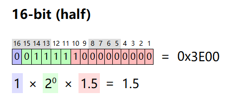

- [原码、反码、补码、移码](#原码反码补码移码)
  - [原码](#原码)
  - [反码](#反码)
  - [补码](#补码)
  - [移码](#移码)
  - [0的原码、反码、补码、移码](#0的原码反码补码移码)
- [浮点数的二进制表示](#浮点数的二进制表示)
- [浮点数加法运算](#浮点数加法运算)
- [规格化](#规格化)
- [TODO](#todo)

### 原码、反码、补码、移码

原码、反码、补码和移码是计算机中表示和处理有符号数的几种方法。

#### 原码

[原码](https://zh.wikipedia.org/wiki/%E5%8E%9F%E7%A0%81)是计算机中表示有符号数的一种最简单的方法。它使用最高位表示符号位，0表示正数，1表示负数，其余位表示数值的绝对值。例如，8位二进制数中，+5的原码表示为`00000101`，-5的原码表示为`10000101`。

表示范围：8位原码的表示范围为`[-127~+127]`

#### 反码

[反码](https://zh.wikipedia.org/wiki/%E4%B8%80%E8%A3%9C%E6%95%B8)是对原码的一种改进表示方法。正数的反码与原码相同，负数的反码是对原码逐位取反（符号位除外）。例如，8位二进制数中，+5的反码表示为`00000101`，-5的反码表示为`11111010`。

表示范围：8位反码的表示范围为`[-127~+127]`

#### 补码

[补码](https://zh.wikipedia.org/wiki/%E4%BA%8C%E8%A3%9C%E6%95%B8)是计算机中最常用的表示有符号数的方法，**常用于进行数字加减法**。正数的补码与原码相同，负数的补码是其反码加1。例如，8位二进制数中，+5的补码表示为`00000101`，-5的补码表示为`11111011`。  

表示范围：8位补码的表示范围为`[-128~+127]`

下表为4位补码与十进制的对应关系

| 补码 | 十进制 |
| ---- | ------ |
| 0111 | 7      |
| 0110 | 6      |
| ...  | ...    |
| 0010 | 2      |
| 0001 | 1      |
| 0000 | 0      |
| 1111 | −1     |
| 1110 | −2     |
| ...  | ...    |
| 1001 | −7     |
| 1000 | −8     |

以4位补码为例，可以将补码理解为在原数字的基础上进行了偏移处理的结果。补码的范围是`0~15`，而原数字的范围是`-8~7`。具体来说：

1. 对于`0`和正数，补码的值与原数字相同，范围为`0~7`。
2. 对于负数，补码的值是从最大值`15`开始向`0`偏移，范围为`15~8`。例如，`-1`的补码为`15`，`-2`的补码为`14`，依此类推，直到`-8`的补码为`8`。

补码可以简化有符号整数的加减法运算，将其都统一成补码的加法运算

```
    0011 (3)
  + 1111 (-1)
--------------
   10010 (2)
```

#### 移码

[移码](https://zh.wikipedia.org/wiki/%E7%A7%BB%E7%A0%81)**通常用于表示浮点运算的阶码**。无论正数负数，都是将该原码的补码的首位(符号位) 取反得到移码。例如，假设使用8位移码，则+5的移码表示为`10000101`，-5的移码表示为`01111011`。

在数轴上，移码所表示的范围，恰好对应于真值在数轴上的范围向正方向移动${2^{n}}$个单元

补码表示的好处在于去掉了负号，但人们很难从形式上判断真值大小，与人们的习惯不符;因为补码表示中符号也成了一位二进制的数，而移码的表示中与补码相差一个符号位，而且可以从移码看出真值的大小，转换方便。

| 补码 | 移码 | 十进制 |
| ---- | ---- | ------ |
| 0111 | 1111 | 7      |
| 0110 | 1110 | 6      |
| ...  | ...  | ...    |
| 0010 | 1010 | 2      |
| 0001 | 1001 | 1      |
| 0000 | 1000 | 0      |
| 1111 | 0111 | −1     |
| 1110 | 0110 | −2     |
| ...  | ...  | ...    |
| 1001 | 0001 | −7     |
| 1000 | 0000 | −8     |

#### 0的原码、反码、补码、移码

|     | 原码     | 反码     | 补码     | 移码     |
| --- | -------- | -------- | -------- | -------- |
| +0  | 00000000 | 00000000 | 00000000 | 10000000 |
| -0  | 10000000 | 11111111 | 00000000 | 10000000 |

### 浮点数的二进制表示

下面以[半精度浮点数](https://zh.wikipedia.org/wiki/%E5%8D%8A%E7%B2%BE%E5%BA%A6%E6%B5%AE%E7%82%B9%E6%95%B0)为例



半精度浮点数的二进制表示主要包含：符号位(16)、指数位(15-11)、尾数(10-1)

- 符号位：浮点数的正负
- 指数位：表示浮点数的指数部分（采用偏移法表示）
- 尾数：表示浮点数的精确值

### 浮点数加法运算

1. 首先先进性对阶，阶码小的向阶码大的对齐，同时尾数进行右移（变小）。
2. 然后再对尾数进行加减法运算。
3. 然后进行规格化处理（IEEE754）。

### 规格化

1.对于原码表示的尾数 尾数**最高有效位为1**时，浮点数为规格化。
2对于补码表示的尾数 当**数符位与尾数最高有效位相异**时，浮点数为规格化。

### TODO
