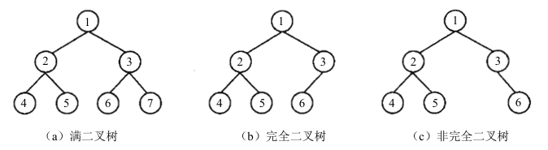
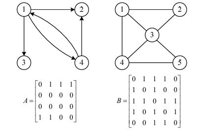
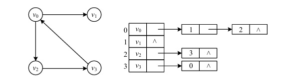
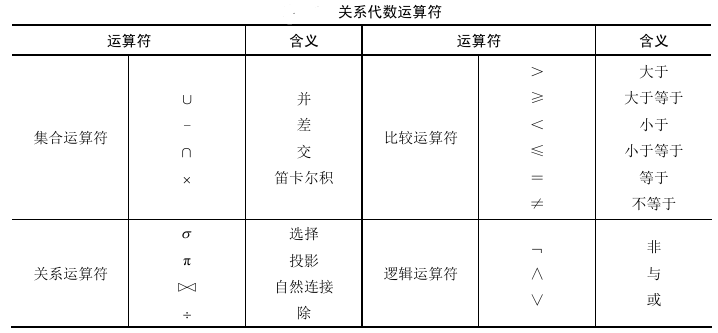
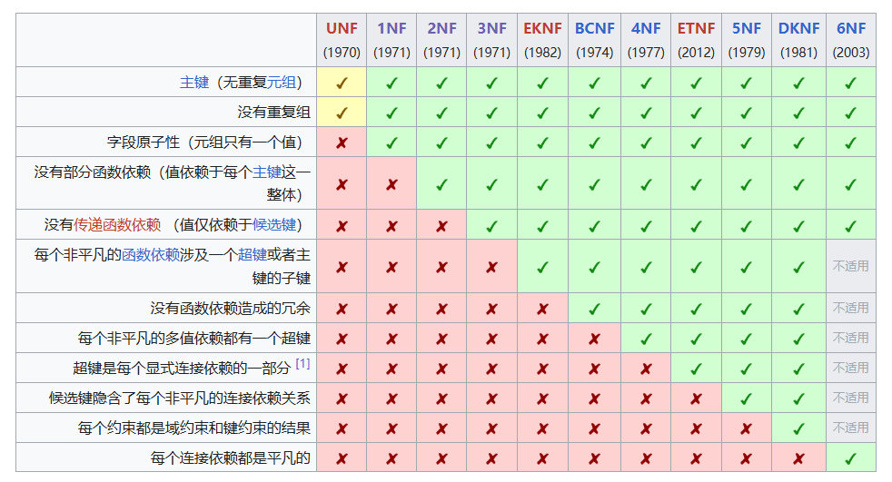
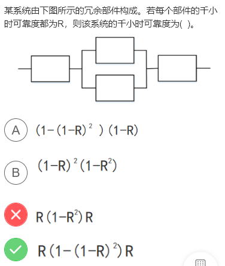

- [计算机系统知识](#计算机系统知识)
  - [CPU的组成](#cpu的组成)
  - [存储系统](#存储系统)
  - [校验码](#校验码)
  - [输入输出](#输入输出)
- [程序设计语言基础知识](#程序设计语言基础知识)
  - [后缀式](#后缀式)
- [数据结构与数据运算](#数据结构与数据运算)
  - [树](#树)
  - [图](#图)
  - [查找](#查找)
  - [排序](#排序)
- [软件工程基础知识](#软件工程基础知识)
  - [软件过程模型](#软件过程模型)
  - [软件的四个维护方面](#软件的四个维护方面)
- [结构化开发方法](#结构化开发方法)
  - [结构化分析方法](#结构化分析方法)
  - [结构化设计方法](#结构化设计方法)
- [面向对象技术](#面向对象技术)
  - [面向对象测试](#面向对象测试)
  - [UML的关系](#uml的关系)
  - [设计原则](#设计原则)
  - [设计模式](#设计模式)
    - [创建型设计模式](#创建型设计模式)
    - [结构型设计模式](#结构型设计模式)
    - [行为设计模式](#行为设计模式)
- [数据库技术基础](#数据库技术基础)
  - [关系数据库的规范化](#关系数据库的规范化)
      - [Armstrong公理](#armstrong公理)
  - [数据库操作](#数据库操作)
  - [关系数据库的规范化](#关系数据库的规范化-1)
  - [权限](#权限)
- [网络与信息安全基础知识](#网络与信息安全基础知识)
  - [网络体系结构](#网络体系结构)
- [未分类](#未分类)
  - [关键路径](#关键路径)
  - [树的度、叶子节点数、边数](#树的度叶子节点数边数)
  - [常见协议功能和默认端口](#常见协议功能和默认端口)
  - [常见算法](#常见算法)
  - [可靠度](#可靠度)
  - [数据库安全相关术语](#数据库安全相关术语)
  - [软件测试方法](#软件测试方法)

# 计算机系统知识

## CPU的组成

CPU主要由运算器、控制器、寄存器组和内部总线等部件组成

- **运算器**
  - **算术逻辑单元(ALU)**:负责处理数据，实现对数据的算术运算和逻辑运算。
  - **累加寄存器(AC)**:也称为累加器，是一个通用寄存器，功能是当运算器的算术逻辑单元执行算术运算或逻辑运算时，为ALU提供一个工作区。
  - **数据缓冲寄存器(DR)**:在对内存储器进行读/写操作时，用DR暂时存放由内存储器读/写的一条指令或一个数据字，将不同时间段内的读/写数据隔离。主要作用是作为CPU和内存、外部设备之间数据传送的中转站;作为CPU和内存、外围设备之间在操作速度上的缓冲;在单累加器结构的运算器中，数据缓冲寄存器还可兼作为操作数据寄存器。
  - **状态条件寄存器(PSW)**:由算数指令和逻辑指令运行或测试的结果建立的各种条件码内容，主要分为状态标志和控制标志
- **控制器**
  - **指令寄存器（IR）**:当CPU执行一条指令时，先把它从内存储器取到缓冲寄存器中，再送入IR暂存，指令译码器根据IR的内容产生各种微操作指令，控制其他的组成部件工作，完成所需的功能。
  - **程序计数器（PC）**:**存储下一条要执行的指令的地址**，具有寄存信息和计数两种功能，又称为指令计数器。程序的执行分为两种情况，一是顺序执行，二是转移执行。
  - **地址寄存器（AR）**:保存当前CPU所访问的内存单元的地址。
  - **指令译码器（ID）**:指令分为操作码和地址码两个部分，为了执行任何给定的命令，必须对操作码进行分析，以便识别所有完成的操作。
- **寄存器组**
  寄存器组分为专用寄存器和通用寄存器。运算器和控制器中的寄存器是专用寄存器，其作用是固定的。通用寄存器的用途广泛，并且由程序员规定其用途，其数目因处理器的不同有所差异。

## 存储系统

- **CPU**对应的存储类别:**寄存器**
- **Cache**对应的存储类别:**缓存**
- **DRAM**对应的存储类别:**主存**
- **硬盘、光盘**对应的存储类别:**辅存**

## 校验码

- **奇偶校验码** 
   奇偶校验码（Parity Code）是一种简单有效的校验方法。这种方法通过在编码中增加一位校验位，使编码中1的个数为奇数（奇校验）或偶数（偶校验），从而使码距变为2。
- **海明码** 
   海明码（Hamming Code）是利用奇偶性来查错和纠错的校验方法。
   1. 海明码确定校验位公式：
      $2^k-1 \geq n+k$
      $k$：检验位
      $n$：数据位
      $n+k$：数据总位数
   2. 校验码在二进制串中的位置为2的整数幂。剩下的位置为数据。如下表所示（以1010110这个二进制数为例）：
      
      

      | 位置 | 0001 | 0010 | 0011 | 0100 | 0101 | 0110 | 0111 | 1000 | 1001 | 1010 | 1011 |
      | ---- | ---- | ---- | ---- | ---- | ---- | ---- | ---- | ---- | ---- | ---- | ---- |
      | 内容 | x1   | x2   | 1    | x3   | 0    | 1    | 0    | x4   | 1    | 1    | 0    |
      
      

      
      为了求出x2,要使所有位置的第二位是1的数据（即形如**1*的位置的数据）的异或值为0（不同为1相同为0，结果就是有偶数个1）。即`x2^1^1^0^1^0 = 0`。因此x2 = 1。
      同理可得x1 = 0, x3 = 1, x4 = 0。
      
      

      
      | 位置 | 0001 | 0010 | 0011 | 0100 | 0101 | 0110 | 0111 | 1000 | 1001 | 1010 | 1011 |
      | ---- | ---- | ---- | ---- | ---- | ---- | ---- | ---- | ---- | ---- | ---- | ---- |
      | 内容 | 0    | 1    | 1    | 1    | 0    | 1    | 0    | 0    | 1    | 1    | 0    |

      

- **循环冗余校验码** 
   循环冗余校验码（Cyclic Redundancy Check，CRC）由两部分组成，左边为信息码（数据），右边为校验码。

## 输入输出

- 程序控制(查询)方式：分为无条件传送和程序查询方式。方法简单，硬件开销小，但IO能力不 高，严重影响CPU的利用率。
- 程序中断方式：与程序控制方式相比，中断方式因为CPU无需等待而提高了传输请求的响应速度。
- DMA方式：DMA方式是为了在主存与外设之间实现高速、批量数据交换而设置的。DMA方式比程序控制方式与中断方式都高效。

# 程序设计语言基础知识

## 后缀式

解决该类问题的方法是将算术表达式构造成一棵二叉树，然后对二叉树进行后序遍历得到后缀式。

`a+(b-c)*d`的后缀式是`abc-d*+`

`b*(a+c)-d`的后缀式是`bac+*d-`

# 数据结构与数据运算

## 树

- **满二叉树**：如果一个二叉树的层数为K，结点总数为$2^k-1$个，则它就是满二叉树。 
- **完全二叉树**：在一个深度为h的完全二叉树中，除第h层外（最后一层），其他各层都是满的。第h层所有的结点都必须从左到右依次放置，不能留空。

## 图

有向图、无向图以及其邻接矩阵

邻接表：邻接表表示法是指为图中的每一个顶点建立一个单链表。

有向图及其邻接表如下图所示

## 查找

1. 顺序查找
   将待查的元素从头到尾与表中元素进行比较，如果存在，则返回成功；否则，查找失败。此方法效率不高。顺序查找的平均查找长度为$(n+1)/2$。
2. 二分查找
  二分查找的前提是元素有序（一般是升序），基本思路是拿中间元素$A[m]$与要查找的元素$x$进行比较，如果相等，则表示找到；如果$A[m]$比$x$大，那么要找的元素一定在$A[m]$前边（左边）；如果$A[m]$比$x$小，那么要找的元素一定在$A[m]$后边（右边）。每进行一次查找，数组规模减半。反复将子数组规模减半或使当前子数组为空，直到发现要查找的元素。
  长度为$n$的有序数组二分查找的最大查找次数为$\lceil \log_2 n \rceil$（向上取整）。
3. 哈希查找

## 排序

| 排序算法     | 平均         | 最好         | 最坏         | 空间       | 排序方式  | 稳定性 | 备注                                                                                                                                                                                              |
| ------------ | ------------ | ------------ | ------------ | ---------- | --------- | ------ | ------------------------------------------------------------------------------------------------------------------------------------------------------------------------------------------------- |
| 直接插入排序 | $O(n^2)$     | $O(n)$       | $O(n^2)$     | $O(1)$     | In-place  | 稳定   | 左侧已排序，右侧未排序，在插入第$i$个记录时，$R_1$,$R_2$,...,$R_{i-1}$均已排好序，这时将第$i$`个记录依次与$R_{i-1}$,...,$R_2$,$R_1$进行比较，找到合适的位置插入，插入位置及之后的记录依次向后移动 |
| 冒泡排序     | $O(n^2)$     | $O(n)$       | $O(n^2)$     | $O(1)$     | In-place  | 稳定   | 通过相邻元素（$i$ 与 $i-1$）之间的比较和交换，将排序码较小的元素逐渐从底层移向顶层。                                                                                                              |
| 简单选择排序 | $O(n^2)$     | $O(n^2)$     | $O(n^2)$     | $O(1)$     | In-place  | 不稳定 | 左侧已排序，右侧未排序，在右侧未排序序列中选择一个最小/最大元素与右侧未排序序列中最左边元素交换                                                                                                   |
| 希尔排序     | $O(n^{1.3})$ | $O(n^{1.3})$ | $O(n^{1.3})$ | $O(1)$     | In-place  | 不稳定 | 先将整个序列分为若干子列（由某个增量控制），插入排序子列，减少增量，直至减少为1                                                                                                                   |
| 快速排序     | $O(nlog_n)$  | $O(nlog_n)$  | $O(n^2)$     | $O(log_n)$ | In-place  | 不稳定 | 使用分而治之思想，选中一个基数（base），比它大的放在右，比它小的放在左，分别在递归排序左右两个序列                                                                                                |
| 堆排序       | $O(nlog_n)$  | $O(nlog_n)$  | $O(nlog_n)$  | $O(1)$     | In-place  | 不稳定 |                                                                                                                                                                                                   |
| 归并排序     | $O(nlog_n)$  | $O(nlog_n)$  | $O(nlog_n)$  | $O(n)$     | Out-place | 稳定   |                                                                                                                                                                                                   |

排序算法的稳定性是指在排序过程中，相等元素的相对顺序是否保持不变。如果一个排序算法在排序后，所有相等元素的相对顺序与排序前相同，那么这个排序算法就是稳定的；否则就是不稳定的。

# 软件工程基础知识

## 软件过程模型

1. **瀑布模型**：只适用于**需求明确**或者**二次开发**（需求稳定），当需求不明确时，最终开发的项目会错误，有很大的缺陷。
   - 瀑布模型的优点：容易理解、成本低、强调开发的阶段性早期计划及需求调查和产品测试。
   - 瀑布模型的缺点：**缺乏灵活性**，客户必须要准确地表达他们的需要；在开始的两个或三个阶段中，很难评估真正的进度状态；项目快结束时，出现大量的集成与测试工作；项目结束之前，不能演示系统的能力。
2. **V模型**：强调测试贯穿项目始终，而不是集中在测试阶段。是一种测试的开发模型。是瀑布模型的一个变体。
3. **增量模型**：可以有**多个可用版本**的发布，核心功能往往最先完成，在此基础上，每轮迭代会有新的增量发布， 核心功能可以得到充分测试。强调每一个增量均发布一个可操作的产品。
   - 增量模型的优点：可交付的第一个版本所需要的成本和时间很少，开发由增量表示的小系统所承担的风险不大，由于很快发布了第一个版本，因此可减少用户需求的变更。同时，它也具有瀑布模型所有的优点。
   - 增量模型的缺点：若没有对用户的变更要求进行规划，那么产生的初始增量可能会造成后来增量的不稳定；若需求不像早期思考的那样稳定和完整，那么一些增量就可能需要重新开发或重新发布；管理发生的成本、进度和配置的复杂性可能会超出组织的能力。
4. **演化模型（原型模型、螺旋模型）**：典型的演化模型有原型模型和螺旋模型。
   - **原型模型**：典型的原型开发方法模型。适用于需求不明确的场景，可以帮助用户明确需求。
   - **螺旋模型**：**结合了瀑布模型和演化模型的优点**，但是增加了**风险分析**，针对**需求不明确**的项目，这也是其最大的特点。**适合大型项目开发**。
5. **喷泉模型**：**以用户需求为动力**，**以对象为驱动**，适合于**面向对象**的开发方法
6. **基于构件的开发模型**：基于构件的开发模型是指利用预先包装的构件来构造应用系统。构件可以是组织内部开发的构件，也可以是商品化成品（COTS）软件构件。一种基于构件的开发模型包括领域工程和应用系统工程。
7. **形式化方法模型**：形式化方法是建立在严格数学基础上的一种软件开发方法，主要活动是生成计算机软件形式化的数学规格说明。
8. **统一过程模型**：统一过程（UP）模型是一种“用例和风险驱动，以架构为中心，迭代并增量”的开发过程，由UML方法和工具支持。
   - 统一过程的典型代表是RUP，RUP是UP的商业扩展，完全兼容UP，比UP更完整、更详细。
   - 敏捷方法的总体目标是通过“尽可能早地、持续地对有价值的软件进行交付”使客户满意。敏捷过程的典型方法有很多，每一种方法基于一套原则，这些原则实现了敏捷方法所宣称的理念，即敏捷宣言。
   - 常用的方法：极限编程（XP）、水晶法（Crystal）、并列争球法（Scrum）、自适应软件开发（ASD）、敏捷统一过程（AUP）。

## 软件的四个维护方面

- **改正性维护**是指改正在系统开发阶段已发生而系统测试阶段尚未发现的错误。
- **适应性维护**是指使应用软件适应信息技术变化和管理需求变化而进行的修改。
- **完善性维护**是指为了扩充功能和改善性能而进行的修改，主要是指对已有的软件系统增加一些在系统分析和设计阶段中没有规定的功能与性能特征。
- **预防性维护**是指为了改进应用软件的可靠性和可维护性，为了适应未来的软件、硬件环境的变化，应主动增加预防性的新功能，以使应用系统可以适应各类变化而不被淘汰。

# 结构化开发方法

## 结构化分析方法

结构化分析（SA）概述 
抽象（自底向上）、分解（自顶向下）

数据流图（DFD）的基本要素：外部实体、加工、数据存储、数据流

数据流图的常见错误

数据流图的审查 
1. 一致性：父图与子图平衡、数据守恒、具备数据存储、输出不能与输入同名。 
2. 完整性：奇迹（无入有出）、黑洞（有入无出）、灰洞（无法出）。

## 结构化设计方法

1. **模块结构图**是结构化设计的工具，由**模块**、**调用**、**数据**、**控制**和**转接**五种基本符号组成。
2. 结构化设计主要包括：**体系结构设计**、**数据设计**、**接口设计**、**过程设计**。

# 面向对象技术

## 面向对象测试

面向对象测试分为四个层次执行:
- **算法层**:测试**类中定义的每个方法**，基本相当于传统软件测试的单元测试。
- **类层**:测试封装在**同一个类中的所有方法与属性之间的相互作用**。可以认为是面向对象测试中特有的模块测试。
- **模板层**:测试一组协调工作的**类之间的相互作用**。大体上相当于传统软件测试中的集成测试。
- **系统层**:把各个子系统组装成完整的面向对象软件系统，在组装过程中同时进行测试。

## UML的关系

UML中有四种关系：**依赖**、**关联**、**泛化**和**实现**

- **依赖关系**：一个事物发生变化影响另一个事物。
- **关联关系**：描述了一组链，链是对象之间的连接。
- **泛化关系**：特殊/一般关系。
- **实现关系**：接口与类之间的关系。
- **聚合关系**：整体与部分生命周期不同。
- **组合关系**：整体与部分生命周期相同。

## 设计原则

- **稳定抽象原则**:此原则强调的是包的抽象程度与其稳定程度一致。
- **稳定依赖原则**:此原则要求包之间的依赖关系都应该是稳定方向依赖的，即包要依赖的包要比自己更具有稳定性。
- **依赖倒置原则**:此原则强调的是程序应该依赖于抽象接口，而不是具体的实现，从而降低客户与实现模块间的耦合。
- **无环依赖**:这个原则明确指出，在组件的依赖关系在图中不允许存在环。

## 设计模式

### 创建型设计模式

- **抽象工厂（Abstract Factory）**  
  提供一个接口，用于创建相关或依赖对象的家族，而无需明确指定具体类。  
  **应用场景**：需要创建一组相关或相互依赖的对象时，例如跨平台 UI 工具包。

- **生成器（Builder）**  
  将一个复杂对象的构建过程与其表示分离，使得同样的构建过程可以创建不同的表示。  
  **应用场景**：需要创建复杂对象，并且需要灵活地控制其构建过程时，例如构建器模式用于生成复杂的文档或报表。

- **工厂方法（Factory Method）**  
  定义一个用于创建对象的接口，让子类决定实例化哪一个类。  
  **应用场景**：当一个类无法预知它需要创建的对象时，例如日志记录器可以根据配置选择不同的日志记录方式。

- **原型（Prototype）**  
  通过复制现有对象来创建新对象，而不是通过实例化类。  
  **应用场景**：需要大量相似对象时，例如克隆复杂对象以提高性能。

- **单例（Singleton）**  
  确保一个类只有一个实例，并提供一个全局访问点。  
  **应用场景**：需要全局唯一的对象时，例如配置管理器、线程池或数据库连接池。

### 结构型设计模式

- **适配器（Adapter）**  
  将一个类的接口转换成客户希望的另一个接口，使得原本由于接口不兼容而不能一起工作的类可以协同工作。  
  **应用场景**：系统需要使用现有的类，但其接口不符合需求时，例如将旧系统的接口适配到新系统。

- **桥接（Bridge）**  
  将抽象部分与实现部分分离，使它们可以独立变化。  
  **应用场景**：需要在抽象和实现之间增加更多的灵活性时，例如跨平台图形界面工具。

- **组合（Composite）**  
  将对象组合成树形结构以表示“部分-整体”的层次结构，使得客户端可以统一地处理单个对象和组合对象。  
  **应用场景**：需要表示对象的部分-整体层次结构时，例如文件系统中的文件和文件夹。

- **装饰（Decorator）**  
  动态地给对象添加一些额外的职责，而不影响其他对象的功能。  
  **应用场景**：需要动态地扩展对象的功能时，例如为图形界面组件添加滚动条或边框。

- **外观（Facade）**  
  为子系统中的一组接口提供一个一致的界面，使得子系统更容易使用。  
  **应用场景**：需要为复杂的子系统提供一个简单的接口时，例如为多模块系统提供统一的入口。

- **享元（Flyweight）**  
  运用共享技术有效地支持大量细粒度对象的复用，减少内存消耗。  
  **应用场景**：需要大量相似对象时，例如字符处理系统中的字符对象。

- **代理（Proxy）**  
  为其他对象提供一种代理以控制对这个对象的访问。  
  **应用场景**：需要控制对对象的访问时，例如远程代理、虚拟代理或保护代理。

### 行为设计模式

- **责任链（Chain of Responsibility）**  
  允许多个对象有机会处理请求，将这些对象连成一条链，沿着链传递请求，直到某个对象处理它为止。  
  **应用场景**：日志处理、权限校验等。

- **命令（Command）**  
  将请求封装为对象，使得可以用不同的请求、队列或日志来参数化对象。支持撤销和重做操作。  
  **应用场景**：事务操作、按钮点击事件处理。

- **解释器（Interpreter）**  
  定义一种语言的文法表示，并提供一个解释器来解释语言中的句子。  
  **应用场景**：编译器、正则表达式解析器。

- **迭代器（Iterator）**  
  提供一种方法顺序访问集合对象中的元素，而不暴露其内部表示。  
  **应用场景**：遍历集合（如数组、链表）。

- **中介者（Mediator）**  
  用一个中介对象封装一组对象之间的交互，使对象之间不需要直接引用，降低耦合性。  
  **应用场景**：聊天室、MVC 中的控制器。

- **备忘录（Memento）**  
  在不破坏封装的前提下，捕获对象的内部状态，并在以后恢复它。  
  **应用场景**：撤销功能、游戏存档。

- **观察者（Observer）**  
  定义对象间的一对多依赖关系，当一个对象状态改变时，所有依赖它的对象都会收到通知并自动更新。  
  **应用场景**：事件监听、发布-订阅模式。

- **状态（State）**  
  允许对象在内部状态改变时改变其行为，看起来像是改变了其类。  
  **应用场景**：状态机、订单状态管理。

- **策略（Strategy）**  
  定义一系列算法，将每个算法封装起来，并使它们可以互换。  
  **应用场景**：支付方式选择、排序算法。

- **模板方法（Template Method）**  
  定义一个操作的骨架，将一些步骤延迟到子类中。子类可以不改变骨架的情况下重新定义某些步骤。  
  **应用场景**：算法框架、代码生成器。

- **访问者（Visitor）**  
  提供一种操作一组对象的方法，使得可以在不改变这些对象的类的前提下定义新的操作。  
  **应用场景**：编译器语法树操作、对象结构遍历。

# 数据库技术基础

## 关系数据库的规范化

#### Armstrong公理

Armstrong公理系统设关系模式`R<U,F>`，其中U为属性集，F是U上的一组函数依赖，那么有如下推理规则：

A1**自反律**：若`Y⊆X⊆U`，则`X→Y`为F所蕴含；
A2**增广律**：若`X→Y`为F所蕴含，且`Z⊆U`，则`XZ→YZ`为F所蕴含；
A3**传递律**：若`X→Y`，`Y→Z`为F所蕴含，则`X→Z`为F所蕴含。

根据上面三条推理规则，又可推出下面三条推理规则：

**合并**规则：若`X→Y`，`X→Z`，则`X→YZ`为F所蕴含。
**分解**规则：若`X→Y`，`Z⊆Y`，则`X→Z`为F所蕴含。
**伪传递**规则：若`X→Y`，`WY→Z`，则`XW→Z`为F所蕴含。

## 数据库操作

基本关系运算

1. 笛卡尔积：相乘。 
2. 投影π：选列。 
3. 选择σ：选行。
4. 自然连接~：结果的属性列数是二者之和减去重复列数，结果元组是同名属性列取值相等的元组。

## 关系数据库的规范化

- [1NF](https://zh.wikipedia.org/wiki/1NF)：属性值都是不可分的**原子值**。
- [2NF](https://zh.wikipedia.org/wiki/2NF)：在1NF基础上，消除了非主属性对候选键的**部分函数依赖**。
- [3NF](https://zh.wikipedia.org/wiki/3NF)：在2NF基础上，消除了非主属性对候选键的**传递函数依赖**。
- [4NF](https://zh.wikipedia.org/wiki/%E7%AC%AC%E5%9B%9B%E8%8C%83%E5%BC%8F)：消除了**多值依赖**的问题。

## 权限

- GRANT：授权
- REVOKE：撤权

# 网络与信息安全基础知识

## 网络体系结构

| 层次 | 名称       | 主要功能                     | 主要设备及协议                                       |
| ---- | ---------- | ---------------------------- | ---------------------------------------------------- |
| 7    | 应用层     | 实现具体的应用功能           | POP3、FTP、HTTP、Telnet、SMTP、DHCP、TFTP、SNMP、DNS |
| 6    | 表示层     | 数据的格式与表达、加密、压缩 | 同应用层 ↑                                           |
| 5    | 会话层     | 建立、管理和终止会话         | 同应用层 ↑                                           |
| 4    | 传输层     | 端到端的连接（端口）         | TCP、UDP                                             |
| 3    | 网络层     | 分组传输和路由选择（IP）     | 三层交换机、路由器、ARP、RARP、IP、ICMP、IGMP        |
| 2    | 数据链路层 | 传送以帧为单位的信息（MAC）  | 网桥、交换机、网卡、PPPT、L2TP、SLIP、PPP            |
| 1    | 物理层     | 二进制传输（01）             | 中继器、集线器                                       |

# 未分类

## 关键路径

项目软件活动图中，关键路径指的是从开始到结束最长的一条路径

## 树的度、叶子节点数、边数

问：
对于一棵树，每个结点的孩子个数称为结点的度，结点度数的最大值成为树的度。某树T的度为4，其中有`5`个度为`4`的结点，`8`个度为`3`的结点，`6`个度为`2`的结点，`10`个度为`1`的结点，则T中的叶子结点个数为?

解：
设度为0的叶子结点数为$n_0$,度为1的结点数为$n_1$，度为2的结点数为$n_2$，度为3的结点数是$n_3$，度为4的结点数为$n_4$

$n_1=10$

$n_2=6$

$n_3=8$

$n_4=5$

这里有一个公式

$边的总数=结点总数-1$

度数为n的节点会向下产生n条边，那么就有

$4n_4+3n_3+2n_2+n_1=n_0+n_1+n_2+n_3+n_4-1$

$20+24+12+10=n_0+29-1$

$n_0=38$

因此叶子结点个数为38

## 常见协议功能和默认端口

| 协议名 | 默认端口      | 功能                                 | 特殊说明                                                                                                                         |
| ------ | ------------- | ------------------------------------ | -------------------------------------------------------------------------------------------------------------------------------- |
| HTTP   | 80            | 超文本传输协议，网页传输             | 不安全，结合SSL的HTTPS协议是安全的超文本传输协议，默认端口443                                                                    |
| Telnet | 23            | 远程协议                             | 不安全，SSH是安全的远程协议                                                                                                      |
| FTP    | 20数据 21控制 | 文件传输协议                         | 不安全，结合SSL的SFTP是安全的文件传输协议。                                                                                      |
| POP3   | 110           | 邮件收取                             | 附加多媒体数据时需采用MIME（MIME不安全，结合SSL的MIME/S是安全的多媒体邮件协议）。使用WEB方式收发电子邮件时必须设置账号密码登录。 |
| SMTP   | 25            | 邮件发送                             |                                                                                                                                  |
| DNS    | 53            | 域名解析协议，记录域名与IP的映射关系 | 本地客户端主机首查本机hosts文件 域名服务器首查本地缓存                                                                           |
| DHCP   | 67            | IP 地址自动分配                      | 169.254.X.X 和 0.0.0.0 是无效地址                                                                                                |
| SNMP   | 161           | 简单网络管理协议                     | 服务器仅发送消息给当前团体                                                                                                       |
| ARP    |               | 地址解析协议，IP 地址转换为 MAC 地址 | ARP Request 请求采用广播进行传送 ARP Response 响应采用单播进行传送                                                               |
| RARP   |               | 反向地址解析协议，MAC 地址转 IP 地址 | 无                                                                                                                               |
| ICMP   |               | 因特网控制协议                       | PING 命令来自该协议                                                                                                              |
| IGMP   |               | 组播协议                             | 无                                                                                                                               |

## 常见算法

1. Hash算法
   - SHA
2. 对称加密算法
   - DES
   - IDEA
3. 非对称加密算法
   - RSA

## 可靠度

- 串联的可靠度位每个部件相乘
- 并联的可靠度为$(1-(1-R)^n)$
  其中$(1-R)$为单个组件的不可靠度，并联的总体不可靠度为**单个组件的不可靠度的乘积**$(1-R)^n$，因此总体的可靠度为$(1-(1-R)^n)$

## 数据库安全相关术语

- **拖库**: 本是数据库领域的专用术语，指从数据库中导出数据。现指网站遭到入侵后，黑客窃取数据库的行为，即数据库信息泄露。
- **撞库**: 使用大量从一个网站获取的账号密码，尝试登录另一个网站。基于用户密码复用率较高的问题，利用泄露的密码尝试其他网站。
- **洗库**: 黑客入侵网站后获取大量用户数据，通过技术手段和黑色产业链将有价值的数据变现。
- **社工库**: 黑客将获取的各种数据库关联起来，对用户进行全方位画像。

## 软件测试方法
